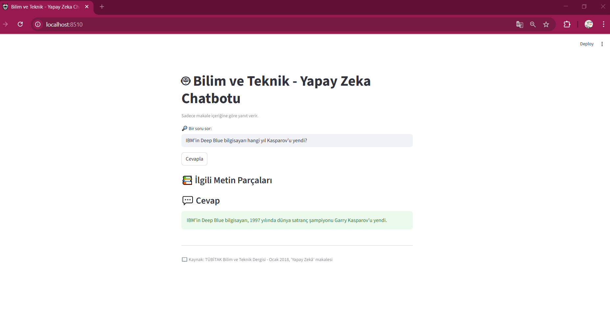

# 🤖 Bilim ve Teknik - Yapay Zeka Chatbotu

## 🎯 Projenin Amacı
Bu proje, **TÜBİTAK Bilim ve Teknik Dergisi’nin Ocak 2018 sayısındaki “Yapay Zeka” makalesine** dayalı olarak geliştirilmiş bir **RAG (Retrieval-Augmented Generation)** tabanlı chatbot’tur. 
Amaç, kullanıcıların yalnızca bu makalede yer alan bilgilere dayanarak sorularına **doğru, güvenilir ve kaynak temelli** cevaplar almasını sağlamaktır.  
Model, makale dışı konulara yanıt vermeyerek **bilgi doğruluğu** ve **kaynak güvenilirliği** ilkelerini korur.


## 🌐 Canlı Demo

💡 Projenin canlı halini test etmek için aşağıdaki bağlantıyı ziyaret edebilirsiniz:
🔗 Bilim ve Teknik Chatbotu - Canlı Demo


## 📁 Proje Yapısı
```
bilim-ve-teknik-yapay-zeka-chatbotu/
│
├── rag_yapayzeka_chatbot/
│   ├── __pycache__/
│   ├── chroma_db/               # Chroma vektör veritabanı
│   ├── images/                  # Görseller (isteğe bağlı)
│   ├── .env                     # Ortam değişkenleri (Google API key vs.)
│   ├── app.py                   # Streamlit ana uygulama dosyası
│   ├── prepare_data.py          # Veri ön işleme (PDF parçalama)
│   ├── rag_pipeline.py          # RAG pipeline (LLM + Retriever + QA)
│   ├── yapay_zeka_chunks_clean2.json  # JSON veri kaynağı
│   ├── yazi.pdf                 # Kaynak PDF (makale)
│
├── .gitattributes
├── Dockerfile                   # Cloud Run için Docker yapılandırması
├── dockerignore
├── gitignore
├── README.md
└── requirements.txt

```

## 🎨 Uygulama Arayüzü

Aşağıda, chatbot arayüzünün örnek görünümü yer almaktadır:




## 📚 Veri Seti

Bu proje, **TÜBİTAK Bilim ve Teknik Dergisi – Ocak 2018 sayısında yayımlanan "Yapay Zeka" makalesi** temel alınarak oluşturulmuştur.

- **Kaynak PDF:** [Makale PDF’ini Görüntüle](rag_yapayzeka_chatbot/yazi.pdf)
- **Sayfa Sayısı:** 10  
- **Yazar:** Gürkan Caner Birer (Bilgisayar Mühendisi)  
- **Yayın:** TÜBİTAK Bilim ve Teknik Dergisi, Ocak 2018  
- **Konular:**
  - Yapay zekanın tanımı ve tarihsel gelişimi  
  - Makine öğrenmesi ve derin öğrenme  
  - Zayıf ve güçlü yapay zeka farkı  
  - Genetik algoritmalar  
  - Turing Testi ve donanımın önemi  
  - Büyük veri kavramı  

Veri ön işleme sonucunda `yapay_zeka_chunks_clean2.json` adlı bir dosya oluşturulmuştur.  
Bu dosya, makaleden alınan metinlerin **1500 karakterlik parçalara** (chunk) ayrıldığı ve  
**Chroma vektör veritabanına** uygun hale getirildiği sürümdür.


## ⚙️ Kullanılan Teknolojiler

| Bileşen | Teknoloji | Açıklama |
|----------|------------|-----------|
| **LLM (Generation Model)** | 🧠 Google Gemini 2.5 Pro | Türkçe destekli, güvenilir yanıtlar üretir. |
| **Embedding Model** | 🔤 HuggingFace paraphrase-multilingual-MiniLM-L12-v2 | Türkçe metinleri anlam temelli vektörlere dönüştürür. |
| **Vektör Veritabanı** | 💾 ChromaDB | Metin embedding’lerini saklar ve en alakalı bölümleri getirir. |
| **Framework** | 🧩 LangChain | LLM, retriever ve prompt’u entegre eder. |
| **Web Arayüzü** | 🌐 Streamlit | Kullanıcı dostu etkileşimli arayüz sağlar. |


## 🧩 Mimari Akış
```
Kullanıcı → Streamlit UI → RAG Pipeline → Retriever (Chroma) → LLM (Gemini) → Cevap
```


## 📌 Örnek Sorular ve Cevaplar

| 💬 Soru | 🤖 Chatbot Cevabı |
|----------|-------------------|
| **1. Yapay zeka terimini ilk kim kullandı?** | Yapay zeka terimini ilk olarak 1956’daki Dartmouth Konferansı’nda Prof. John McCarthy kullanmıştır. |
| **2. IBM’in Deep Blue bilgisayarı neyi başardı?** | IBM’in geliştirdiği Deep Blue, 1997 yılında dünya satranç şampiyonu Garry Kasparov’u yenerek yapay zekâ tarihinde önemli bir dönüm noktası olmuştur. |
| **3. Makine öğrenmesi nedir?** | Makine öğrenmesi, yapay zekânın alt dallarından biridir. En basit tanımıyla, bilgisayarların insanlar gibi öğrenmesini sağlayan bir bilim dalıdır. Bu alandaki temel amaç, bilgisayarların karmaşık örüntüleri tanıyarak ve verilerden yola çıkarak akılcı kararlar vermesini sağlamaktır. |
| **4. Genetik algoritma nasıl çalışır?** | Genetik algoritmalar canlılardaki gen değişimine benzer şekilde, olası çözümler arasında en iyi sonucu verenleri seçip birleştirerek gelişir. |
| **5. Güçlü yapay zeka ile zayıf yapay zeka arasındaki fark nedir?** | Makaleye göre genetik algoritmalarda, olası çözümlerden oluşan bir popülasyon oluşturulur. Her bir çözümün uygunluğu bir fonksiyon ile değerlendirilir. Daha sonra, doğal seçilim, çaprazlama ve mutasyon gibi evrimsel operatörler kullanılarak yeni nesil çözümler üretilir. Bu süreç, en iyi çözüme ulaşılana kadar tekrarlanır. |


## 🧮 Lokal Kurulum Adımları
🧩 Ortam Değişkeni (API Anahtarı) Ayarlama

Bu proje, Google Gemini API kullanmaktadır.
API anahtarı, güvenlik nedeniyle .env dosyasında tutulur ve GitHub’a yüklenmez.

Kendi bilgisayarınızda çalıştırmak için:

1️⃣ Proje klasörünüzün kök dizininde bir .env dosyası oluşturun.
2️⃣ İçine aşağıdaki satırı ekleyin:

GOOGLE_API_KEY=your_google_api_key_here


⚠️ Not: “your_google_api_key_here” kısmına kendi Google API anahtarınızı yazın.
API anahtarınızı Google AI Studio
 üzerinden ücretsiz olarak oluşturabilirsiniz.

3️⃣ Ardından aşağıdaki komutlarla uygulamayı çalıştırabilirsiniz:

pip install -r requirements.txt
python prepare_data.py
python rag_pipeline.py
streamlit run app.py


🧠 Uygulama, .env dosyasını otomatik okuyarak API anahtarınızı yükler.
.gitignore sayesinde bu dosya GitHub’a asla yüklenmez.


## 🧠 Proje Özeti

Bu proje, **RAG (Retrieval-Augmented Generation)** tabanlı bir chatbot uygulamasının uçtan uca geliştirilmesini amaçlamaktadır.  
Aşağıdaki kriterler, projenin genel başarısını ve teslim kalitesini belirler:

### 🔹 1. Geliştirme Ortamı (VS Code + GitHub + README)
- Proje **Visual Studio Code (VS Code)** ortamında geliştirilmiştir.  
- GitHub üzerinde versiyon kontrolü sağlanmış ve proje açık kaynak olarak paylaşılmıştır.  
- `README.md` dosyasında:
  - Projenin amacı, kurulum adımları, veri seti, mimari yapı ve örnek sorular detaylı biçimde açıklanmıştır.  
  - Proje klasör yapısı ve çalışma talimatları kullanıcı dostu şekilde düzenlenmiştir.  
- `.gitignore` dosyası ile gizli veriler (örneğin `.env` dosyası) korunmuştur.  

### 🔹 2. Veri Seti Hazırlama
- Kaynak: **TÜBİTAK Bilim ve Teknik Dergisi – Ocak 2018 sayısı, “Yapay Zeka” makalesi.**  
- Makale, **PyPDFLoader** aracıyla PDF formatından okunmuştur.  
- Metin verisi **regex** kullanılarak temizlenmiş, satır sonları, dip notlar ve özel karakterler düzeltilmiştir.  
- **RecursiveCharacterTextSplitter** ile 1500 karakterlik anlamlı parçalara (chunk) bölünmüştür.  
- Nihai çıktı `yapay_zeka_chunks_clean2.json` dosyasında saklanmıştır.  
- Vektör embedding işlemleri **ChromaDB** veritabanına kaydedilmiştir.  

### 🔹 3. Çalışma Kılavuzu
- Kurulum, `.env` yapılandırması ve çalışma adımları README’de açık biçimde anlatılmıştır.  
- Kullanıcı yalnızca şu komutlarla uygulamayı çalıştırabilir:
  ```bash
  pip install -r requirements.txt
  streamlit run app.py

### 🔹 4. RAG Mimarisi (LangChain + Gemini + Chroma)
- **LangChain** çerçevesiyle RAG pipeline oluşturulmuştur.  
- **ChromaDB** vektör veritabanı, embedding’leri saklamak ve en alakalı bilgi parçalarını bulmak için kullanılmıştır.  
- **Gemini 2.5 Pro (Google Generative AI)** modeli, yalnızca makale bağlamında tutarlı ve anlamlı yanıtlar üretmiştir. 

### 🔹 5. Web Arayüzü (Streamlit)
- Kullanıcı arayüzü **Streamlit** framework’ü kullanılarak geliştirilmiştir.  
- Arayüz, sade, etkileşimli ve kullanıcı dostu olacak şekilde tasarlanmıştır.  
- Kullanıcı bir soru girdiğinde sistem şu adımları izler:
  1. Soruyu **embedding**’e dönüştürür.  
  2. **Chroma** veritabanından en alakalı bilgi parçalarını bulur.  
  3. Bulunan bağlamı **Gemini 2.5 Pro** modeline iletir.  
  4. LLM, yalnızca makale içeriğine dayanarak tutarlı bir Türkçe yanıt üretir.  
- Arayüzde, kullanıcıya hem **ilgili metin parçaları** hem de **üretilen nihai cevap** gösterilir.  


Bu proje, **Akbank GenAI Bootcamp** kapsamında eğitim amaçlı geliştirilmiştir.
